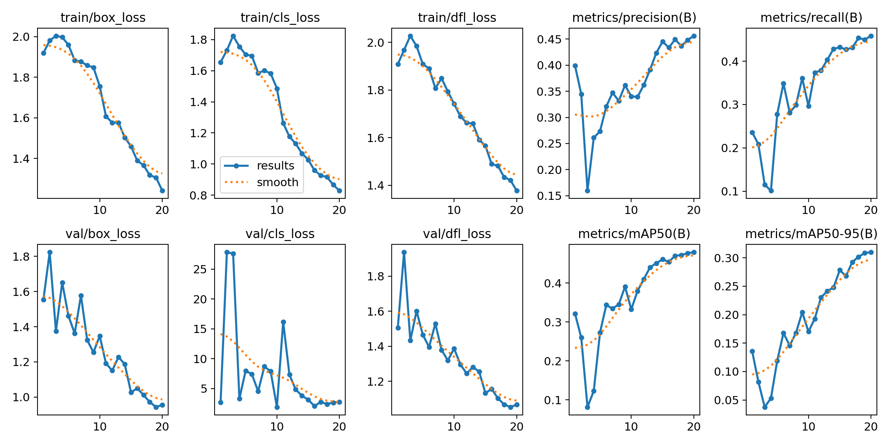

# Underwater Object Detection Using YOLOv11  

## Project Overview  
This project focuses on developing a robust object detection system capable of identifying humans in underwater environments. Leveraging the YOLOv11 deep learning model, it addresses challenges such as low visibility, distortion, and debris often encountered in underwater rescue missions.  

The project implements state-of-the-art techniques and innovative data preprocessing strategies to enhance detection accuracy and reliability in real-time scenarios.  

## Features  
- **State-of-the-Art Model**: Utilizes YOLOv11, optimized for underwater object detection.  
- **Custom Dataset**: Combines multiple datasets including Roboflow Human Dataset and Kaggle Underwater Dataset.  
- **Data Augmentation**: Enhances model robustness using techniques like flipping, scaling, rotation, and color jittering.  
- **Real-Time Detection**: Efficiently detects humans in challenging underwater environments.  

## Dataset  
The model is trained on a custom dataset tailored for underwater object detection.  
Download the dataset from this [OneDrive link](https://rrcca-my.sharepoint.com/:f:/g/personal/gagandeepsingh8_rrc_ca/EpbLjJ5QsNBGgUtKOrq_ZrQBqFAolODAoneCCbyZBz64-Q?e=yGhjBq).  

## Model Details  
YOLOv11 architecture includes:  
- **Backbone**: CSPNet for efficient feature extraction.  
- **Neck**: FPN with PANet for multi-scale feature aggregation.  
- **Head**: Anchor-free detection for bounding box predictions.  
- **Optimization**: Uses AdamW optimizer and a multi-task loss function combining CIoU, Binary Cross-Entropy, and Focal Loss.  

## Results  

The YOLOv11 model achieved the highest mAP and precision among tested architectures, outperforming ResNet50, VGG16, and simpler models.  



---

## Getting Started  

### Install environment
```bash
python -m venv env  
source env/bin/activate  # On Linux/macOS  
env\Scripts\activate     # On Windows  
pip install -r requirements.txt
```

### Clone the Repository  
```bash  
git clone https://github.com/gdsai4903/COMP3704_final_project.git  
cd COMP3704_final_project

This project is a part of COMP-3704 Neural Networks and Deep Learning, Fall 2024 at Red River College Polytechnic.
